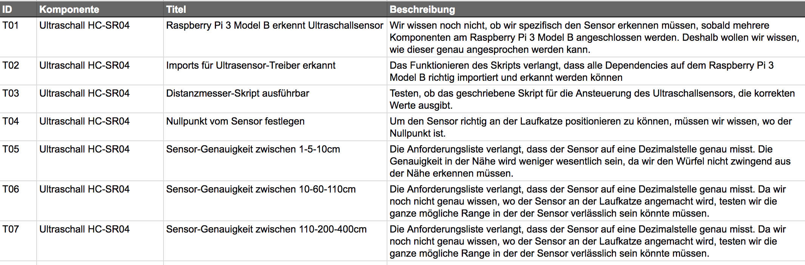

# HC-SR04 Ultraschall-Sensor

## Masse


Grösse:	43 x 15 x 20 <br>
Working Voltage：DC 5V <br>
Working Current： 15mA <br>
Standby current： - <br>
Load Weight： - <br>
Ranging Distance: 2cm - 4m <br>

Quelle: http://www.micropik.com/PDF/HCSR04.pdf

## Eigenschaften

Für das Messen der Koordinaten der Laufkatze, wird der Ultraschall-Sensor HC-SR04 verwendet. Dieser eignet sich zur Messung der Distanz im Bereich zwischen 2cm - 4m. Da die Laufstrecke 3.5m beträgt werden die folgenden zwei Sensoren verwendet:

1. Sensor hinten, wird verwendet bis der Startmasten zu tief ist
2. Sensor vorne, wird verwendet sobald Sensor hinten nicht mehr sendet. Dieser misst dann den Abstand zum Endmasten

Anhand dieser Information werden wir die x- aber auch die y-Koordinaten der Laufkatze berechnen, da wir die Steigung des Seils kennen. 

<p style="color:blue">TODO: Berechnungen der Steigung von David und wie wir dann die Position der Laufkatze definieren</p>

 Quelle: http://richmondsystems.net/2017/07/23/ultrasonic-sensor-hc-sr04-arduino/


Der Sensor arbeitet mit Ultraschall und sendet eine Schallwelle bei rund 40'000 Hz aus. Falls sich Objekte im Weg der Schallwelle befinden wird sie zurück zum Modul gesendet. Danach wird die Distanz berechnet, anhand der Geschwindigkeit mit der sich die Welle bewegt und der Zeit bis die Welle wieder beim Modul ankommt.

$Distanz = \frac{Zeit \times Schallgeschwindigkeit}{2}$

## Ansteuerung

Um den Sensor anzusteuern, verwenden wir unser Raspberry Pi. Dazu werden auch zwei Resistoren benötigt (1 x 330Ω und 1 x 470Ω). Wir verbinden den Ultraschallsensor mit den GPIO I/Os. Danach führen wir das folgende Python-Skript aus:

```python
# Libraries
import RPi.GPIO as GPIO
import time

# GPIO Mode (BOARD / BCM)
GPIO.setmode(GPIO.BCM)

# set GPIO Pins
GPIO_TRIGGER = 18
GPIO_ECHO = 24

# set GPIO direction (IN / OUT)
GPIO.setup(GPIO_TRIGGER, GPIO.OUT)
GPIO.setup(GPIO_ECHO, GPIO.IN)


def distance():
    # set Trigger to HIGH
    GPIO.output(GPIO_TRIGGER, True)

    # set Trigger after 0.01ms to LOW
    time.sleep(0.00001)
    GPIO.output(GPIO_TRIGGER, False)

    StartTime = time.time()
    StopTime = time.time()

    # save StartTime
    while GPIO.input(GPIO_ECHO) == 0:
        StartTime = time.time()

    # save time of arrival
    while GPIO.input(GPIO_ECHO) == 1:
        StopTime = time.time()

    # time difference between start and arrival
    TimeElapsed = StopTime - StartTime
    # multiply with the sonic speed (34300 cm/s)
    # and divide by 2, because there and back
    distance = (TimeElapsed * 34300) / 2

    return distance


if __name__ == '__main__':
    try:
        while True:
            dist = distance()
            print ("Measured Distance = %.1f cm" % dist)
            time.sleep(1)

            # Reset by pressing CTRL + C
    except KeyboardInterrupt:
        print("Measurement stopped by User")
        GPIO.cleanup()
```

Dieses Skript ist noch nicht das finale Skript. Es zeigt jedoch ziemlich gut wie die einzelnen Pins angesprochen und das Signal vom Raspberry Pi aus gesendet wird.

## Testing

Um zu wissen wie konsistent und verlässlich die Senosren messen, haben wir Testfälle dazu erstellt:



Einige Testfälle haben wir bereits durchgeführt und die Ergebnisse in einem Testprotokoll (siehe `TP01-Testprotokoll-Ultraschallsensor-HC-SR04`) erfasst. Ein auffallend negatives Ergebnis war, dass der Winkel in dem der Sensor die Distanz misst grösser wird desto grösser die Distanz wird (siehe Abbildung unten). Der Sensor misst immer das nächste Gerät. Das bedeutet, dass Objekte das Signal stören können, je nachdem wie wir den Sensor richten.

 

Quelle Sensor: https://www.aimagin.com/media/catalog/product/cache/1/image/9df78eab33525d08d6e5fb8d27136e95/h/c/hc-sr04-02.jpg
