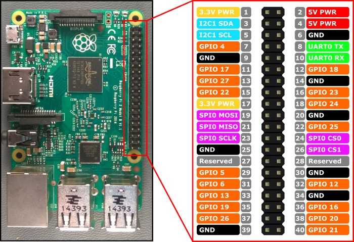

# Notes IT

Distrelec: CHF 69.55.-  Christopher

15.03.18
23.03.18
09.04.18

## Pi-Features

* Time-To-Boot mit [Service] TimoutStartSec=5: ca. 20s
* Time-To-Reboot mit [Service] TimoutStartSec=5: ca. 23s

## Wifi

`nano /etc/wpa_supplicant/wpa_supplicant.conf`

```shell
network={
        ssid=""
        psk=""
}
```

`wpa_cli -i wlan0 reconfigure`

### Links
* http://www.wildow.com/blog/?p=1945
* 

## Python Threads

### Theory
Da wir Tasks simultan auf der Raspberry Pi laufen lassen müssen, verwenden wir Threads, um dies sinnvoll umzusetzen.

Weiter unten ist ein konkretes Beispiel und als weitere Lektüre verwenden wir: 

* O'reilly - Programmin Python - Mark Lutz
* https://www.tutorialspoint.com/python/python_multithreading.htm

*Source: Learn Raspberry Pi Programming With Python*

```python
# Define thread object

class myObject(threading.Thread):
	def __init__(self):
 		#function used to initiate the class and thread
 		threading.Thread.__init__(self) #necessary to start the thread
 	def run(self):
 		#function performed while thread is running
```

From the main portion of the program, we can start the thread by declaring a new `myObject` object (a new thread):

```python
	newObject = myObject()
```

and then starting it with

```python
	newObject.start()
```

The thread is now running with its own instance of the myObject, called newObject. Our thread (as shown in the final code at the end of the chapter) will be initiated with `threading.Thread.__init__(self)`. Once it has been started, it will continue to execute its function (in our case, collecting GPS data and taking pictures) until we quit the program.

### Example

```python
import os
from gps import *
from time import *
import time
import threading
import logging
from subprocess import call

#set up logfile
logging.basicConfig(filename='locations.log', level=logging.DEBUG, format='%(message)s')

picnum = 0
gpsd = None

class GpsPoller(threading.Thread):
 	def __init__(self): #initializes thread
 		threading.Thread.__init__(self)
 		global gpsd
 		gpsd = gps(mode=WATCH_ENABLE)
 		self.current_value = None
 		self.running = True
 
 
 	def run(self): #actions taken by thread
 		global gpsd
 		while gpsp.running:
 			gpsd.next()

if __name__ == '__main__': #if in the main program section,
 	gpsp = GpsPoller() 		#start a thread and start logging
 	try: 					#and taking pictures
 		gpsp.start()
 		while True: #log location from GPS
 		logging.info	(str(gpsd.fix.longitude) + " " + str(gpsd.fix.latitude) + " " +
str(gpsd.fix.altitude))	

 		#save numbered image in correct directory
 		call(["raspistill -o /home/pi/Documents/plane/image" + str(picnum) +
".jpg"], shell=True)
 		picnum = picnum + 1 #increment picture number
 		time.sleep(3)
 	except (KeyboardInterrupt, SystemExit):
 		gpsp.running = False
 		gpsp.join()
```

## Run Programs On Startup

Following things must be defined and done at startup of the Raspberry Pi:

### Run scripts during boot:

`nano /etc/rc.local`


### Automatic Login as Pi

Create a user `pi` and add any password:

`adduser pi`

Then change the settings to autologin on boot as `pi` in `raspi-config`:

`raspi-config`

### Automatic Login as Root

Make sure in your `raspi-config`-settings that you have the following option enabled:

*B1 Console: Text console, requiring user to login*

Then edit the following file `/lib/systemd/system/getty@.service` as described below.

This line: `ExecStart=-/sbin/agetty --noclear %I $TERM` must be changed to:

`ExecStart=-/sbin/agetty --noclear -a root %I $TERM`


### Setup a static IP
This enables us to connect to the Raspberry Pi via SSH just in case we need to connect to it this way.

```python
ifconfig eth0 192.168.0.1 netmask 255.255.255.0
```

## Miscellaneous Raspberry Pi Information

### SSH Public Key

```sh
ssh-rsa AAAAB3NzaC1yc2EAAAADAQABAAABAQCpMaWHXo+GGccUM8PiDJVWFdwPJGvkX/wxnMP7hwWAyq0bqnry8GFJj6ZMzRcY4BsLjEroiqXZZ8ZQOw86ph59XIsIzAOb+ExRggWiQ7goPVpq/g7PQcO0AgUUBcAHNlwvGEyH1VDRxJsNy4e55nedR4wYqQ5vL198BJB2wTBfqGI+K3Rrlvyy2VeZhGmoSBYI542MT2JcgWrRNVdAkElq8urrcXoyoqkYxekhXpb4RflQgwjPKxdX+PdVokj3bRKCxBIxFlD4gAoGV44gyV0/eM+vuXqAvoHTVBrtC0HreTQ5x+mnwnW+2XHSjdXVEYklj18ZWX6z+DGtt/Zw3agL root@minibian
```

## GPIO Pins
Um die verschiedenen Komponenten, welche am Raspberry Pi angeschlossen sind, ansteuern zu können, verwenden wir die GPIO Pins des Raspberry Pis. Folgende Pins sind besetzt:

* 5v: StepperH, Speisung


* 12: ElectroMagnet, Outputsignal
* 16: SharpSensor, Inputsignal
* 18: Ultraschall, Outputsignal
* 20: 
* 24: Ultraschall, Inputsignal



## Distance Sensor

### Analog
https://www.dfrobot.com/wiki/index.php/Sharp_GP2Y0A02YK_IR_ranger_sensor_(150cm)_(SKU:SEN0013)

Der "SHARP GP2Y0A02YK IR ranger sensor" misst mit Infrarot continuierlich die Distanz und gibt eine analoge Spannung zurück. 

Code in C++:

```c++
/*
  description:
  The sample code is used to measure distance by GP2Y0A02YK IR ranger sensor.
  VCC -- VCC
  GND -- GND
  Signal -- Analog 1    
*/

int IRpin = 1;                                    // analog pin for reading the IR sensor

void setup() {
  Serial.begin(9600);                             // start the serial port
}

void loop() {
  float volts = analogRead(IRpin)*0.0048828125;   // value from sensor * (5/1024) - if running 3.3.volts then change 5 to 3.3
  float distance = 65*pow(volts, -1.10);          // worked out from graph 65 = theretical distance / (1/Volts)
  Serial.println(distance);                       // print the distance
  delay(100);                                     // arbitary wait time.
}
```

Beispielcode von tutorials_raspberry in Python:

https://tutorials-raspberrypi.de/infrarot-abstandsmessung-mit-dem-raspberry-pi-sharp-gp2y0a02yk0f/

```python
#!/usr/bin/python
 
import spidev
 
spi = spidev.SpiDev()
spi.open(0,0)
 
 
def readChannel(channel):
  val = spi.xfer2([1,(8+channel)<<4,0])
  data = ((val[1]&3) << 8) + val[2]
  return data
  
if __name__ == "__main__":
  v=(readChannel(0)/1023.0)*3.3
  dist = 16.2537 * v**4 - 129.893 * v**3 + 382.268 * v**2 - 512.611 * v + 301.439
  print "Distanz: %.2f cm" % dist
```

## Positionserkennung

## Important Links

"A start job is running for LSB: raise network interfaces": 

* https://ubuntuforums.org/showthread.php?t=2323253
* https://unix.stackexchange.com/questions/385281/why-im-giving-message-a-start-job-is-running-for-raise-network-interfaces-at
* https://www.raspberrypi.org/forums/viewtopic.php?t=135369
* Solution: https://unix.stackexchange.com/questions/186162/how-to-change-timeout-in-systemctl

Run bash script **after login**:

* https://stackoverflow.com/questions/39024657/run-bash-script-after-login

**THREADPOOL**:

* https://medium.com/@bfortuner/python-multithreading-vs-multiprocessing-73072ce5600b